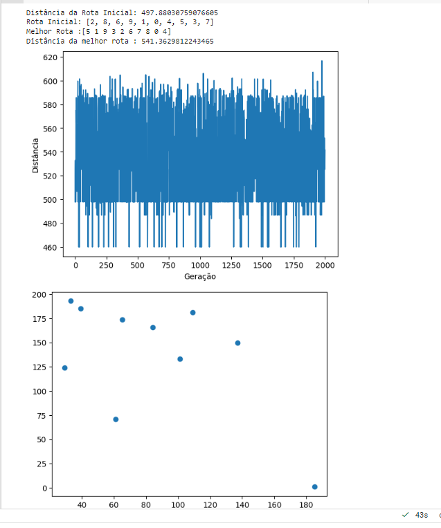
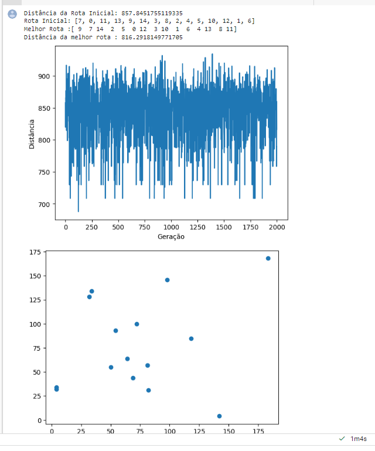
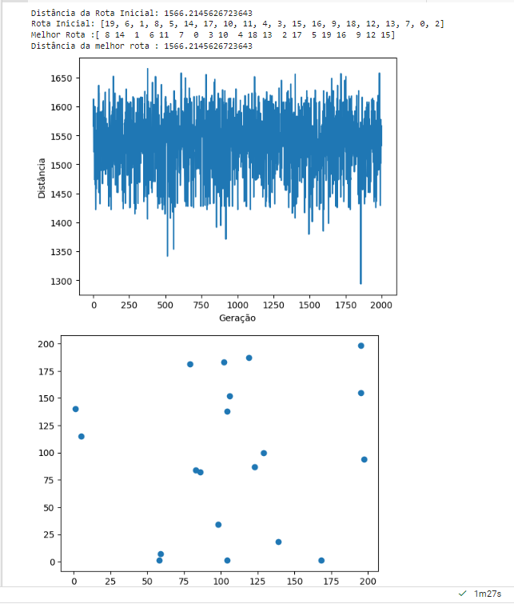

# Problema do Caixeiro Viajante (Traveling Salesman Problem - TSP) utilizando Algoritmos Genéticos
#### _Gustavo Alvarenga Marzoque - 201910392_
#### Professor: Eric Fernandes de Mello Araújo
#### Disciplina - Inteligência Artificial -Turma 14A - UFLA

 
## Introdução

 Esse código visa resolver ao Problema do Caixeiro Viajante (Traveling Salesman Problem - TSP) usando algoritmos genéticos para otimizar a ordem em que um vendedor
visita um conjunto de cidades, buscando encontrar a rota mais curta possível.

## Sobre o Código

#### Bibliotecas utilizadas:
- numpy
- random
- operator
- pandas
- matpllotlib.pyplot

#### Passo a passo

#####Criação da população inicial:
O código vai ser responsável por criar uma população inicial de rotas, recebendo como entrada o tamanho da população e qual a quantidade de cidades. Vai gerar rotas aleatórias pra cada indivíduo da população.

##### Escolha do parceiro
Vai ser selecionado de maneira aleatória um indivíduo da população como 'parceiro de acasalamento'. Recebe como entrada o número máximo de indivíduos presente na população.

##### Distância
É calculada qual a distância entre duas cidades 'i' e 'j' baseado nas suas coordenadas (x,y).

##### Score da população
É realizado o cálculo da distância total percorrida (aptidão) para cada rota na população. Recebe como entrada a população e uma lista de cidades.

##### Fitness ( Função de aptidão) 
É calculado a aptidão de uma rota específica. É recebido como entrada uma rota e a lista das cidades. Vai ser percorrido toda a rota, realizando o cálculo de qual a distância total percorrida.

##### Criação de um novo membro
É criada uma nova rota aleatória que recebe o número de cidades como entrada. É gerada uma lista com todas as cidades e essa lista é embaralhada para se obter uma nova rota aleatória.

##### Crossover
Realiza-se o operador de crossover entre duas rotas 'a' e 'b'. Seleciona uma parte da rota 'a' e insere essa parte na mesma posicao na rota 'b'. Retorna a nova rota resultante do Crossover.

##### Mutação
É feita a mutação em uma rota, com uma certa probabilidade pra cada posição da rota. Para cada posição, a rota pode ser trocada com outra posição aleatória.

##### Seleção
Seleciona os melhores indivíduos (rotas) da população atual com base em seus rankings e retorna uma lista com os índices dos indivíduos selecionados.

##### Rank Rotas
Calcula o ranking de todas as rotas da população com base em sua aptidão (distância percorrida) e retorna uma lista de tuplas contendo o índice da rota e sua aptidão, ordenadas pelo ranking.

##### Cruzamento 
É realizado o cruzamento entre os indivíduos da população de acasalamento (mating_pool), gerando novos indivíduos através do operador de crossover.

##### Mutação 
Realizada a mutação em uma população de indivíduos (rotas) com uma determinada taxa de mutação, se aplica a função mutate em cada indivíduo da população.

##### Acasalamento
Cria a população de acasalamento (matingpool) com base nos resultados da seleção, e seleciona os indivíduos da população com base nos índices fornecidos.

##### Próxima Geração
Gera a próxima geração de indivíduos. Calculando o ranking da população atual, realiza a seleção dos melhores indivíduos, cria a população de acasalamento, realiza o cruzamento e a mutação para gerar a próxima geração.

##### Algoritmo Genético
Faz a implementação do algoritmo genético completo. Recebe como entrada a lista de cidades, o tamanho da população, o tamanho da elite, a taxa de mutação e o número de gerações. Gera a população inicial, itera através das gerações, realiza a seleção, o cruzamento e a mutação para gerar a próxima geração, e retorna a melhor rota encontrada.

## Eficácia do Algoritmo
O algoritmo genético pode ser enxergado como uma abordagem heurística na resolução de problemas de otimização, como o Problema do Caixeiro Viajante. Ele busca encontrar uma solução aproximada, mas não necessariamente encontra a solução ótima em todos os casos.
No contexto do algoritmo em questão, podem ser levados em consideração os seguintes aspectos:

### Qualidade da Solução Encontrada
O algoritmo genético busca encontrar uma rota que minimize a distância total percorrida pelo caixeiro viajante. Quanto menor for a distância encontrada, melhor será a solução. Porém, é importante observar que o algoritmo não garante encontrar a solução ótima em todos os casos.

### Tempo de execução
O tempo de execução do algoritmo é outro fator importante a ser considerado. À medida que o número de cidades aumenta, o tempo necessário para encontrar uma solução aumenta exponencialmente. Portanto, para um grande número de cidades, o algoritmo pode se tornar impraticável em termos de tempo de execução.

### Sensibilidade aos parâmetros
Os parâmetros do algoritmo, como o tamanho da população, a taxa de mutação e o tamanho da elite, podem afetar significativamente o desempenho e a qualidade da solução. É necessário ajustar esses parâmetros de forma adequada para obter melhores resultados.

Em suma, a eficácia do algoritmo vai ser dependente desses fatores.

## Experimentação e análise
Os parâmetros que são passados na função que calcula o algoritmo genético caso alterados podem impactar o comportamento nos resultados. Por exemplo:

### Tamanho da População
É o parâmetro responsável por determinar o tamanho da população inicial, ou seja, o número de rotas/cromossomos que serão criados aleatoriamente no início do algoritmo. Aumentar o tamanho da população pode levar a uma busca mais ampla no espaço de soluções, potencialmente aumentando a diversidade genética. No entanto, isso também pode aumentar o tempo de execução do algoritmo, já que mais rotas precisam ser avaliadas e evoluídas a cada geração.

### Tamanho da Elite 
Esse parâmetro é responsável por definir o número de melhores indivíduos que serão selecionados automaticamente para a próxima geração, independentemente de seu desempenho. Aumentar o tamanho da elite pode aumentar a pressão seletiva sobre a população, acelerando a convergência para melhores soluções. No entanto, se o tamanho da elite for muito grande em relação ao tamanho da população, pode levar à perda de diversidade e a uma convergência prematura para soluções subótimas.

### Taxa de Mutação
Parâmetro que indica a probabilidade de mutação de um gene em um cromossomo durante a reprodução. Aumentar a taxa de mutação pode aumentar a diversidade genética, permitindo que o algoritmo explore novas áreas do espaço de soluções. No entanto, se a taxa de mutação for muito alta, pode ocorrer uma busca aleatória excessiva, o que pode dificultar a convergência para soluções ótimas.

### Gerações
Determina o número de gerações (iterações) que o algoritmo irá executar. Aumentar o número de gerações permite que o algoritmo tenha mais tempo para explorar o espaço de soluções. No entanto, isso também aumenta o tempo de execução do algoritmo. Além disso, é importante observar que, após um certo número de gerações, o algoritmo pode atingir uma convergência e não melhorar significativamente as soluções.

### Testes
#### Teste com 10 cidades:

#### Teste com 15 cidades:

#### Teste com 20 cidades:

É possível perceber que o tempo de execução aumenta consideravelmente à medida que mais cidades são adicionadas.
